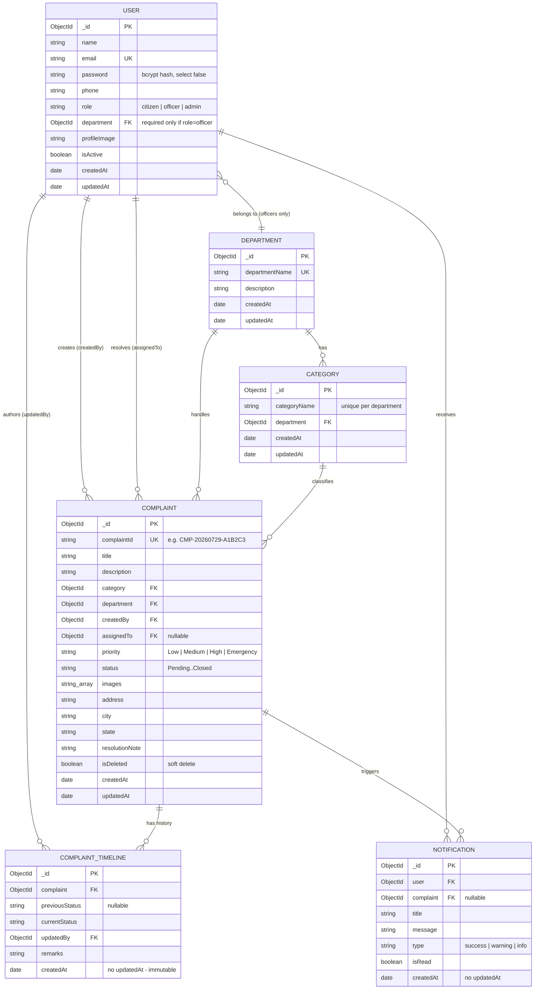

# Database Guide

**Database engine:** MongoDB (via Mongoose 9 ODM)
**Database name:** configurable via `MONGO_URI`'s path segment (e.g. `complaint_management_system`)
**Collections created automatically:** yes — Mongoose creates each collection and its declared indexes the first time it's used; no manual `CREATE TABLE`-equivalent step is needed.

This guide documents every collection exactly as defined in `server/src/models/*.js` — no field, index, or relationship here is inferred or assumed.

---

## Entity-Relationship Diagram



---

## Collections

### `users` (model: `User`)

| Field | Type | Rules |
|---|---|---|
| `name` | String | Required |
| `email` | String | Required, **unique**, lowercased, trimmed |
| `password` | String | Required, min length 8, `select: false` (never returned by default queries — must explicitly `.select('+password')`) |
| `phone` | String | Required, trimmed |
| `role` | String (enum) | `citizen` (default) \| `officer` \| `admin` |
| `department` | ObjectId → `Department` | **Conditionally required** — only when `role === 'officer'` (enforced via a Mongoose function-based `required`, not a static flag) |
| `profileImage` | String | Optional, default `null` (reserved for a future feature — not currently set by any endpoint) |
| `isActive` | Boolean | Default `true`. Setting to `false` immediately blocks login and blocks all authenticated requests (re-checked on every request via `protect` middleware) |
| `createdAt`/`updatedAt` | Date | Automatic (`timestamps: true`) |

**Validation/behavior:**
- Password is hashed via bcrypt (10 salt rounds) in a `pre('save')` hook, only when the `password` path is modified — so updating other fields on a user document never re-hashes an unchanged password.
- `toJSON` is overridden to strip `password` from any serialized output, as a second layer of defense on top of `select: false`.
- **Index:** unique on `email`.

**Example document:**
```json
{
  "_id": "68865f1a2b3c4d5e6f708192",
  "name": "Jane Citizen",
  "email": "jane@example.com",
  "phone": "1234567890",
  "role": "citizen",
  "department": null,
  "profileImage": null,
  "isActive": true,
  "createdAt": "2026-07-29T10:00:00.000Z",
  "updatedAt": "2026-07-29T10:00:00.000Z"
}
```

---

### `departments` (model: `Department`)

| Field | Type | Rules |
|---|---|---|
| `departmentName` | String | Required, **unique**, trimmed |
| `description` | String | Optional, default `''` |

**Index:** unique on `departmentName`.

**Example document:**
```json
{ "_id": "68865f1a2b3c4d5e6f708193", "departmentName": "Water Supply Department", "description": "" }
```

---

### `categories` (model: `Category`)

| Field | Type | Rules |
|---|---|---|
| `categoryName` | String | Required, trimmed |
| `department` | ObjectId → `Department` | Required |

**Index:** compound **unique** on `{ department, categoryName }` — the same category name is allowed to exist under different departments (e.g. "Damage" under both Roads and Electricity), but not duplicated within the same department.

**Example document:**
```json
{ "_id": "68865f1a2b3c4d5e6f708194", "categoryName": "Pipeline Leak", "department": "68865f1a2b3c4d5e6f708193" }
```

---

### `complaints` (model: `Complaint`)

| Field | Type | Rules |
|---|---|---|
| `complaintId` | String | Required, **unique** — human-readable tracking code, format `CMP-YYYYMMDD-<6 hex chars>` (generated by `utils/generateComplaintId.js`, with a uniqueness retry loop in the service layer) |
| `title` | String | Required, trimmed |
| `description` | String | Required, trimmed |
| `category` | ObjectId → `Category` | Required |
| `department` | ObjectId → `Department` | Required |
| `createdBy` | ObjectId → `User` | Required — the citizen who submitted it |
| `assignedTo` | ObjectId → `User` | Nullable — the officer it's assigned to, `null` until an admin assigns it |
| `priority` | String (enum) | `Low` \| `Medium` (default) \| `High` \| `Emergency` |
| `status` | String (enum) | `Pending` (default) \| `Assigned` \| `In Progress` \| `Resolved` \| `Closed` |
| `images` | String[] | Default `[]` — relative paths like `/uploads/complaints/<filename>` |
| `address`, `city`, `state` | String | All required, trimmed |
| `resolutionNote` | String | Default `''` — a free-text note the assigned officer can add, independent of status transitions |
| `isDeleted` | Boolean | Default `false` — **soft delete**; a "deleted" complaint is never actually removed from the collection, just excluded from queries via `{ isDeleted: false }` filters everywhere |

**Indexes:** single-field on `status`, `category`, `department`, `createdBy`, and `createdAt` (descending) — chosen specifically to support the list/filter/sort queries added in Milestone 9 (status filters, department/category filters, and "newest first" being the default sort).

**Example document:**
```json
{
  "_id": "68865f1a2b3c4d5e6f708195",
  "complaintId": "CMP-20260729-A1B2C3",
  "title": "Pipeline leak near school",
  "description": "A detailed description of a leaking pipe near the school gate.",
  "category": "68865f1a2b3c4d5e6f708194",
  "department": "68865f1a2b3c4d5e6f708193",
  "createdBy": "68865f1a2b3c4d5e6f708192",
  "assignedTo": null,
  "priority": "High",
  "status": "Pending",
  "images": [],
  "address": "5 Oak St",
  "city": "Springfield",
  "state": "IL",
  "resolutionNote": "",
  "isDeleted": false,
  "createdAt": "2026-07-29T10:05:00.000Z",
  "updatedAt": "2026-07-29T10:05:00.000Z"
}
```

---

### `complainttimelines` (model: `ComplaintTimeline`)

| Field | Type | Rules |
|---|---|---|
| `complaint` | ObjectId → `Complaint` | Required |
| `previousStatus` | String | Nullable — `null` for the very first entry (submission) |
| `currentStatus` | String | Required |
| `updatedBy` | ObjectId → `User` | Required — whoever caused this transition (citizen on submission, admin on assignment, officer on status updates) |
| `remarks` | String | Default `''` |
| `createdAt` | Date | Automatic. **No `updatedAt`** — entries are immutable, append-only; nothing ever edits a timeline entry after creation |

**Index:** compound on `{ complaint, createdAt }` — supports fetching one complaint's full history in chronological order efficiently.

**Example documents (one complaint's full history):**
```json
[
  { "complaint": "68865f1a2b3c4d5e6f708195", "previousStatus": null, "currentStatus": "Pending", "updatedBy": "68865f1a2b3c4d5e6f708192", "remarks": "Complaint submitted", "createdAt": "2026-07-29T10:05:00.000Z" },
  { "complaint": "68865f1a2b3c4d5e6f708195", "previousStatus": "Pending", "currentStatus": "Assigned", "updatedBy": "<admin id>", "remarks": "Assigned to Sam Officer", "createdAt": "2026-07-29T11:00:00.000Z" }
]
```

---

### `notifications` (model: `Notification`)

| Field | Type | Rules |
|---|---|---|
| `user` | ObjectId → `User` | Required — the recipient |
| `complaint` | ObjectId → `Complaint` | Nullable — most notifications relate to a complaint, but the field isn't required |
| `title` | String | Required |
| `message` | String | Required |
| `type` | String (enum) | `success` \| `warning` \| `info` (default) — drives the notification's visual style on the frontend |
| `isRead` | Boolean | Default `false` |
| `createdAt` | Date | Automatic. **No `updatedAt`** — append-only feed; `isRead` is the only field ever mutated after creation, and that mutation doesn't need its own timestamp |

**Indexes:** compound on `{ user, isRead }` (supports the unread-count query) and `{ user, createdAt }` descending (supports the paginated list, newest first).

**Example document:**
```json
{
  "_id": "68865f1a2b3c4d5e6f708196",
  "user": "68865f1a2b3c4d5e6f708192",
  "complaint": "68865f1a2b3c4d5e6f708195",
  "title": "Complaint assigned",
  "message": "Your complaint CMP-20260729-A1B2C3 has been assigned to an officer.",
  "type": "info",
  "isRead": false,
  "createdAt": "2026-07-29T11:00:00.000Z"
}
```

---

## Relationships summary

| Relationship | Type | Notes |
|---|---|---|
| User (officer) → Department | Many-to-one | Conditionally required — only officers have a department |
| Department → Category | One-to-many | A department can have many categories |
| Category → Complaint | One-to-many | Every complaint belongs to exactly one category |
| Department → Complaint | One-to-many | Denormalized onto the complaint directly (not derived through category) so a complaint can be reassigned to a different department during assignment without touching its category |
| User (citizen, `createdBy`) → Complaint | One-to-many | A citizen can submit many complaints |
| User (officer, `assignedTo`) → Complaint | One-to-many | An officer can be assigned many complaints; nullable until assignment |
| Complaint → ComplaintTimeline | One-to-many | Full audit trail of every status change, immutable |
| User (`updatedBy`) → ComplaintTimeline | One-to-many | Whoever caused each transition |
| Complaint → Notification | One-to-many | A complaint can trigger many notifications (to different recipients, at different lifecycle points) |
| User → Notification | One-to-many | A user can receive many notifications |

---

## Validation approach

Two layers, deliberately redundant (defense in depth, not accidental duplication — see `REPOSITORY_AUDIT_REPORT.md` §7):

1. **Mongoose schema-level validation** (this document) — the last line of defense, enforced no matter how a write reaches the database.
2. **express-validator request-level validation** (`server/src/validators/*.js`, documented in `API_REFERENCE.md`) — runs before a request even reaches the service/model layer, producing the standard `422` error envelope with field-level messages instead of a raw Mongoose `ValidationError`.

---

## Data flow (a complaint's life, database-side)

1. `POST /complaints` → `Complaint.create()` (status `Pending`) + `ComplaintTimeline.create()` (first entry) + `Notification.create()` × (all admins).
2. `PATCH /admin/complaints/:id/assign` → `Complaint` updated (`assignedTo`, `department`, `status: Assigned`) + one new `ComplaintTimeline` entry + 2 new `Notification`s (citizen + officer).
3. `PATCH /officer/complaints/:id/status` (repeatable through the lifecycle) → `Complaint.status` updated + one new `ComplaintTimeline` entry + 1 new `Notification` (citizen).
4. `DELETE /complaints/:id` → `Complaint.isDeleted` flips to `true`; the document, its timeline, and its notifications are **never** physically removed.

---

## Seed data requirements

See `SEEDING_GUIDE.md` for the full walkthrough. In short:
- **No collections need manual creation** — Mongoose creates them (and their indexes) automatically.
- **One manual/scripted step is required before the app is usable**: bootstrapping the first Admin account, since there is no public API to create one (`npm run seed:admin`).
- Demo data (departments/categories/officers/citizens/complaints) is entirely optional and provided by `npm run seed:demo`.
